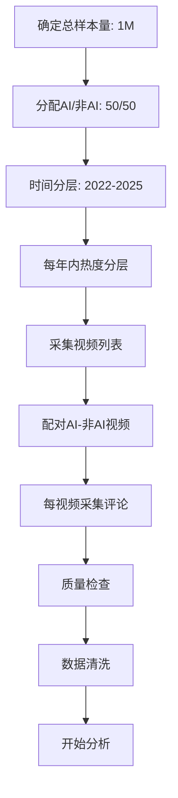

# 研究抽样策略与样本设计指南

> **适用研究**: YouTube短视频AI vs 非AI内容对比分析
> **目标**: 1.3M评论，20M tokens
> **研究期**: 2022-2025（覆盖AI技术爆发期）

---

## 📊 一、AI vs 非AI 样本比例设计

### 1.1 推荐方案：1:1 配对设计 ⭐

**比例**: AI内容 50% : 非AI内容 50%

**理由**:
1. **统计效力最优**
   - 独立样本t检验在1:1比例时效力最高
   - 相同样本量下，检测效应的能力最强
   - 标准误最小

2. **控制混淆变量**
   - 便于配对设计（同观看量级、同时间段）
   - 减少外部因素影响
   - 提高内部效度

3. **国际惯例**
   - 对照研究（case-control study）标准做法
   - 便于与其他研究比较
   - 符合审稿人期望

**实施建议**:
```
目标总样本: 1.3M 评论
├── AI内容: 650K 评论 (50%)
└── 非AI内容: 650K 评论 (50%)
```

### 1.2 备选方案：2:1 或 1:2 不等比例

#### 方案A: 非AI内容 2:1 AI内容

**适用场景**:
- AI内容在YouTube上相对稀缺
- 想重点研究"主流"非AI内容的特征
- 非AI内容内部差异更大（需要更多样本）

**比例**: AI 33% : 非AI 67%
```
总样本: 1.3M
├── AI: 430K (33%)
└── 非AI: 870K (67%)
```

**统计调整**:
- 使用加权t检验（Welch's t-test）
- 效应量计算需考虑样本量差异
- p值解释需更谨慎

#### 方案B: AI内容 2:1 非AI内容

**适用场景**:
- 研究重点是AI内容的细分特征
- AI内容内部差异大（如不同AI工具生成）
- 想充分展现AI内容的多样性

**比例**: AI 67% : 非AI 33%

**问题**:
- 可能被审稿人质疑"为何非AI样本过少"
- 需要强有力的理论支撑
- 不推荐用于首次探索性研究

### 1.3 不推荐方案

❌ **极端不平衡比例**（如 9:1, 1:9）
- 统计效力严重下降
- 难以建立因果推断
- 审稿人会要求重新采样

❌ **随机比例**（如 43:57）
- 无法解释为何选择此比例
- 看起来缺乏研究设计

### 1.4 样本量计算（基于统计效力）

**公式** (独立样本t检验):
```
n = 2 × (Z_α/2 + Z_β)² × σ² / δ²

其中:
- Z_α/2 = 1.96 (α=0.05, 双尾)
- Z_β = 0.84 (β=0.20, 80%效力)
- σ = 标准差
- δ = 期望检测的最小差异
```

**经验法则**:
- **小效应** (Cohen's d = 0.2): 每组需要 ~400个视频 或 ~20,000条评论
- **中效应** (Cohen's d = 0.5): 每组需要 ~64个视频 或 ~3,200条评论
- **大效应** (Cohen's d = 0.8): 每组需要 ~26个视频 或 ~1,300条评论

**推荐最小样本量**:
```
保守估计（中效应）:
├── 视频层面: 每组至少 100个视频
├── 评论层面: 每组至少 10,000条评论
└── 总计: 200个视频，20,000条评论
```

**理想样本量**（本研究目标）:
```
充分估计（小-中效应）:
├── 视频层面: 每组 500-1000个视频
├── 评论层面: 每组 650,000条评论
└── 总计: 1000-2000个视频，1.3M评论
```

---

## ⏰ 二、时间分布策略

### 2.1 研究问题导向的时间分层

#### 关键时间节点（AI技术发展史）

```
2022年初 - AI早期（Stable Diffusion发布前）
├── DALL-E 2 发布: 2022-04
├── Midjourney Alpha: 2022-07
└── Stable Diffusion 1.0: 2022-08

2022年末-2023年 - AI爆发期
├── ChatGPT 发布: 2022-11
├── GPT-4 发布: 2023-03
├── Midjourney V5: 2023-03
└── AI内容开始大规模出现

2024年 - AI成熟期
├── Sora 发布: 2024-02
├── AI视频工具普及
└── 公众AI认知提升

2025年 - AI常态化期
├── AI内容泛滥
├── 观众审美疲劳?
└── 监管政策出台
```

### 2.2 推荐方案：分层时间抽样 ⭐

**方案**: 按AI发展阶段分层抽样

#### 阶段1: 2022年（早期，5-10%）
- **目标占比**: 5-10% 样本
- **理由**:
  - AI内容稀缺，但有重要对比价值
  - 展现"新鲜感"效应
  - 基线数据

```
2022年样本:
├── AI内容: 30K-60K 评论
├── 非AI内容: 30K-60K 评论
└── 小计: 60K-120K (5-10%)
```

#### 阶段2: 2023年（爆发期，20-30%）
- **目标占比**: 20-30% 样本
- **理由**:
  - ChatGPT引发AI热潮
  - 观众反应最剧烈
  - 最重要的过渡期

```
2023年样本:
├── AI内容: 130K-195K 评论
├── 非AI内容: 130K-195K 评论
└── 小计: 260K-390K (20-30%)
```

#### 阶段3: 2024年（成熟期，30-40%）
- **目标占比**: 30-40% 样本
- **理由**:
  - AI工具成熟
  - 市场达到平衡
  - 主要数据来源

```
2024年样本:
├── AI内容: 195K-260K 评论
├── 非AI内容: 195K-260K 评论
└── 小计: 390K-520K (30-40%)
```

#### 阶段4: 2025年（常态化期，30-40%）
- **目标占比**: 30-40% 样本
- **理由**:
  - 最新数据
  - 审美疲劳效应
  - 长期趋势

```
2025年样本:
├── AI内容: 195K-260K 评论
├── 非AI内容: 195K-260K 评论
└── 小计: 390K-520K (30-40%)
```

### 2.3 备选方案：均匀时间抽样

**方案**: 每个月采集相等数量样本

**比例**: 每月约 2.7% (1/36个月，2022.04-2025.10)

**优点**:
- 简单易实施
- 便于时间序列分析
- 无需主观判断阶段

**缺点**:
- 忽略AI发展的非线性特征
- 早期数据可能不足
- 未充分利用关键时间节点

### 2.4 时间分布的统计检验

**目的**: 确保时间分布不会造成混淆偏差

**方法**:
1. **Chi-square检验**: AI vs 非AI 的时间分布是否相似
   ```python
   from scipy.stats import chi2_contingency
   contingency_table = pd.crosstab(df['content_type'], df['year'])
   chi2, p, dof, expected = chi2_contingency(contingency_table)
   ```

2. **配对时间设计**:
   - 对每个AI视频，找一个同时间段（±1个月）的非AI视频
   - 控制"时间效应"混淆

3. **时间作为协变量**:
   - 使用ANCOVA（协方差分析）
   - 模型: `engagement ~ content_type + year + content_type×year`

---

## 🎯 三、视频层面的抽样策略

### 3.1 视频热度分层（重要！）⭐⭐⭐

**问题**: 热门视频 vs 冷门视频的评论特征差异巨大

**解决方案**: 按观看量分层抽样

#### 分层标准（基于YouTube Shorts统计）

```
Tier 1: 超级热门 (>10M 观看)
├── 占比: 5% 视频
├── 样本: 每组 25-50个视频
└── 特征: 头部内容，代表"爆款"

Tier 2: 高热度 (1M-10M 观看)
├── 占比: 20% 视频
├── 样本: 每组 100-200个视频
└── 特征: 成功内容，较稳定的互动

Tier 3: 中热度 (100K-1M 观看)
├── 占比: 40% 视频
├── 样本: 每组 200-400个视频
└── 特征: 主流内容，数据最丰富

Tier 4: 低热度 (10K-100K 观看)
├── 占比: 30% 视频
├── 样本: 每组 150-300个视频
└── 特征: 长尾内容

Tier 5: 冷门 (<10K 观看)
├── 占比: 5% 视频
├── 样本: 每组 25-50个视频
└── 特征: 边缘内容，但有研究价值
```

**每层样本量计算**:
```python
# 假设每组500个视频
tier_1 = 50   # 5% × 1000
tier_2 = 200  # 20% × 1000
tier_3 = 400  # 40% × 1000
tier_4 = 300  # 30% × 1000
tier_5 = 50   # 5% × 1000
```

### 3.2 每视频评论数策略

#### 方案A: 固定数量抽样 ⭐（推荐）

**方法**: 每个视频采集固定数量评论（如50-100条）

**优点**:
- 样本平衡，便于视频间比较
- 避免热门视频主导数据
- 统计分析简单

**实施**:
```python
comments_per_video = 100  # 固定采集100条
total_videos = 500        # 每组500个视频
total_comments = 50,000   # 每组50K评论
```

**排序策略**:
- 按"最相关"排序（YouTube默认）
- 或按"最新"排序（时间序列研究）
- 或随机采样（减少偏差）

#### 方案B: 按比例抽样

**方法**: 按视频总评论数的一定比例采集

**例如**: 采集10%的评论
- 100条评论的视频 → 采集10条
- 10,000条评论的视频 → 采集1000条

**优点**:
- 反映真实评论分布
- 热门视频数据更丰富

**缺点**:
- 样本极不平衡
- 少数热门视频主导分析
- 需要加权分析

#### 方案C: 上限截断抽样

**方法**: 设置上限（如最多500条/视频）

**适用**:
- 处理极端热门视频
- 平衡数据收集成本
- 防止单个视频过度影响

```python
max_comments_per_video = 500
# 评论数<500: 全部采集
# 评论数≥500: 随机采样500条
```

### 3.3 视频类型多样性

**确保覆盖**:

#### AI内容细分
```
生成工具维度:
├── Midjourney: 30%
├── Stable Diffusion: 25%
├── DALL-E: 15%
├── Runway (视频): 15%
├── 其他/混合: 15%

内容主题维度:
├── 艺术创作: 30%
├── 动画/卡通: 25%
├── 真实感照片: 20%
├── 概念艺术: 15%
├── 其他: 10%
```

#### 非AI内容细分
```
创作类型:
├── 手工艺DIY: 30%
├── 传统绘画: 25%
├── 真人表演: 20%
├── 自然拍摄: 15%
├── 其他: 10%

内容主题（匹配AI内容）:
├── 艺术展示: 30%
├── 教程: 25%
├── Vlog: 20%
├── 创意短片: 15%
├── 其他: 10%
```

---

## 📐 四、抽样偏差控制

### 4.1 选择偏差（Selection Bias）

**问题**:
- AI内容更容易被标注（标题含"AI"）
- 非AI内容可能包含隐藏的AI辅助

**控制方法**:
1. **双重验证**:
   - 机器检测（关键词+视觉分析）
   - 人工抽样验证（10-20%）

2. **严格标准**:
   - AI内容: 明确披露或明显特征
   - 非AI内容: 无AI迹象且创作过程透明

3. **灰色地带处理**:
   - 创建"混合"类别（AI辅助但非完全生成）
   - 或排除（更保守）

### 4.2 时间偏差（Temporal Bias）

**问题**:
- 早期AI内容 vs 晚期AI内容质量差异
- 算法推荐变化影响可见度

**控制方法**:
1. **时间配对**:
   ```python
   for ai_video in ai_videos:
       match_nonai = find_video_in_same_month(
           nonai_videos,
           ai_video.published_date,
           tolerance=±30days
       )
   ```

2. **时间作为协变量**:
   - 所有分析中加入时间变量
   - 检验"内容类型×时间"交互效应

### 4.3 热度偏差（Popularity Bias）

**问题**:
- 热门视频评论质量不同
- 可能造成"辛普森悖论"

**控制方法**:
1. **分层分析**:
   ```python
   for tier in [tier_1, tier_2, tier_3, tier_4, tier_5]:
       analyze_within_tier(ai_videos[tier], nonai_videos[tier])
   ```

2. **倾向得分匹配（PSM）**:
   ```python
   from sklearn.neighbors import NearestNeighbors
   # 基于观看量、时间、主题匹配AI和非AI视频
   ```

3. **加权分析**:
   ```python
   # 根据母群体分布加权
   weights = calculate_inverse_probability_weights(
       sample, population_distribution
   )
   ```

### 4.4 语言偏差（Language Bias）

**问题**:
- 不同语言评论风格差异
- AI内容可能吸引国际观众

**控制方法**:
1. **语言过滤**:
   - 只分析英文评论
   - 或分语言建立子样本

2. **语言配对**:
   - 确保AI和非AI样本语言分布相似

3. **多语言分析**:
   - 如果资源允许，分语言进行对比

---

## 🎯 五、推荐的完整抽样方案

### 方案总览 ⭐⭐⭐

```
研究设计: 分层配对对照研究（Stratified Matched Case-Control Study）
总样本量: 1,000,000 评论（调整为100万便于管理）
研究期: 2022-04 至 2025-10（42个月）
```

### 详细配置

#### 1. 内容类型比例
```
AI内容: 500,000 评论 (50%)
├── 1,000 个视频
└── 平均 500 条评论/视频

非AI内容: 500,000 评论 (50%)
├── 1,000 个视频
└── 平均 500 条评论/视频
```

#### 2. 时间分层
```
2022年（早期）: 100,000 评论 (10%)
├── AI: 50K
└── 非AI: 50K

2023年（爆发）: 250,000 评论 (25%)
├── AI: 125K
└── 非AI: 125K

2024年（成熟）: 350,000 评论 (35%)
├── AI: 175K
└── 非AI: 175K

2025年（常态）: 300,000 评论 (30%)
├── AI: 150K
└── 非AI: 150K
```

#### 3. 热度分层（每年内）
```
每个时间段内:
├── Tier 1 (>10M): 5% 视频
├── Tier 2 (1-10M): 20% 视频
├── Tier 3 (100K-1M): 40% 视频
├── Tier 4 (10K-100K): 30% 视频
└── Tier 5 (<10K): 5% 视频
```

#### 4. 每视频采集策略
```
基础采集: 100 条/视频

热度调整:
├── Tier 1: 500 条（热门需更多）
├── Tier 2: 200 条
├── Tier 3: 100 条
├── Tier 4: 50 条
└── Tier 5: 20 条（冷门较少）
```

#### 5. 配对设计
```
对于每个AI视频，寻找1个非AI视频，满足:
├── 时间: ±30天内发布
├── 热度: 观看量在同一Tier
├── 主题: 相似内容类别
└── 语言: 相同主要语言
```

### 实施流程



---

## 📊 六、样本量充分性检验

### 6.1 最小可检测效应（MDE）

**公式**:
```
MDE = (Z_α/2 + Z_β) × σ × √(2/n)

对于1:1设计，n=500视频/组:
MDE ≈ 2.8 × σ / √500 ≈ 0.125σ

解释: 可以检测到 12.5% 标准差的差异
```

**结论**: 500视频/组足以检测中小效应

### 6.2 多重比较校正

**问题**: 测试多个指标时，需要调整α水平

**Bonferroni校正**:
```
如果测试k个指标，调整后α = 0.05/k

例如测试6个指标:
├── 情感分布
├── 互动率
├── 忠诚度
├── 社区活力
├── 争议性
├── 文本长度
→ α_adjusted = 0.05/6 ≈ 0.0083
```

**样本量增加**:
- 需要增加30-50%样本量以维持80%效力

### 6.3 子群分析（Subgroup Analysis）

**如果要分析子群** (如不同AI工具):
```
每个子群建议最少:
├── 视频: 50-100个
├── 评论: 5,000-10,000条
```

**例如**:
```
AI内容细分（500K评论总量）:
├── Midjourney: 150K (30%)
├── Stable Diffusion: 125K (25%)
├── DALL-E: 75K (15%)
├── Runway: 75K (15%)
└── 其他: 75K (15%)
```

---

## ✅ 七、推荐决策树

```
开始
│
├─ 研究目的是什么？
│  ├─ 探索性（pilot study）
│  │  → 推荐: 100视频/组，5K评论/组，1:1比例
│  │
│  ├─ 验证性（hypothesis testing）
│  │  → 推荐: 500视频/组，250K评论/组，1:1比例
│  │
│  └─ 深度分析（细分市场）
│     → 推荐: 1000视频/组，500K评论/组，分层设计
│
├─ 数据采集资源？
│  ├─ 有限（<1个月）
│  │  → 推荐: 小样本+高质量配对
│  │
│  ├─ 中等（1-3个月）
│  │  → 推荐: 中样本+时间分层
│  │
│  └─ 充足（>3个月）
│     → 推荐: 大样本+全面分层
│
└─ 时间范围？
   ├─ 只关注当前
   │  → 集中采集2024-2025数据
   │
   ├─ 关注演变
   │  → 均衡分布2022-2025
   │
   └─ 关注关键节点
      → 重点采集2023爆发期 + 2025常态期
```

---

## 📚 八、参考文献与标准

### 统计标准
- Cohen, J. (1988). *Statistical Power Analysis for the Behavioral Sciences*
- Hulley, S. B., et al. (2013). *Designing Clinical Research*
- Cochran, W. G. (1977). *Sampling Techniques*

### YouTube研究先例
- Bärtl, M. (2018). YouTube channels, uploads and views: A statistical analysis
- Cheng, X., et al. (2008). Understanding the characteristics of internet short video sharing
- Thelwall, M. (2018). Can social news websites pay for content and curation?

### 社交媒体研究指南
- Pew Research Center - Social Media Sampling Guidelines
- AAPOR - Online Panel Research Best Practices
- Schober, M. F., et al. (2016). Social media analyses for social measurement

---

**文档版本**: 1.0
**创建时间**: 2025-10-17
**更新时间**: -
**作者**: Research Design Guidelines
**适用项目**: AI vs Non-AI YouTube Shorts Analysis

